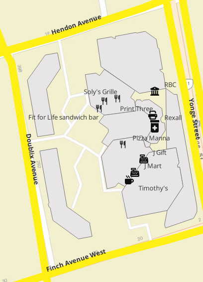

# Mini GIS Geodatabase Project

This project demonstrates the creation, cleaning, enrichment, and symbology of a GIS geodatabase using **QGIS**. It covers the full workflow from raster map input to structured geospatial layers and styled outputs.

---

## 🔍 Project Objective

Transform a raster map (PDF format) into a clean, editable, and attribute-rich geodatabase that can be used in GIS analysis, mapping, or urban planning tasks.

---

## 🧠 Background

As a GIS Senior Consultant (IBM) with over 20 years of experience and a Master's in Geomatics (GIS & Remote Sensing), I regularly work with large spatial datasets and custom-built GIS systems. This mini-project was created as a showcase for:

- Spatial data processing & cleaning  
- Urban base map digitization  
- Multi-language attribute management  
- QGIS geodatabase editing and styling workflows

---

## 🔧 Workflow Summary

1. **Data Source:**  
   - A Toronto neighborhood map in PDF format, converted and georeferenced.

2. **Georeferencing & Preparation:**  
   - Used QGIS georeferencer tools to spatially locate the map.  
   - Exported PNG and auxiliary XML file saved.

3. **Geodatabase Layer Creation:**  
   - **Polygon layer:** Buildings (digitized)  
   - **Line layer:** Roads with direction and street names  
   - **Point layer:** Points of Interest (e.g., stores)  

4. **Attribute Enrichment:**  
   - Multi-language fields: English & Arabic names  
   - Fields for direction, type, purpose  
   - Manual editing of duplicated edges, attribute values, and data errors

5. **Cleaning & Validation:**  
   - Removal of overlapping polygons  
   - Fixing common digitization errors (e.g., duplicate lines, slivers)

6. **Dynamic Symbolization:**  
   - Rule-based and categorized symbology  
   - Custom icons for points  
   - Color-coded roads and buildings  
   - Directional arrows planned for future enhancement

---

## 📂 Project Structure

---

## 🖼️ Preview

---

## 💼 Use Cases

This type of workflow is relevant for:
- Freelance GIS digitizing & mapping work  
- Geodatabase creation and maintenance  
- Urban and regional base mapping  
- Projects involving historical or non-spatial map conversion

---

## 🙋 About the Author

**Essam Afifi**  
Canadian Data & AI Consultant | 20+ Years Experience | Fluent in EN/FR/AR  
🌍 [LinkedIn: Essam Afifi](https://www.linkedin.com/in/essam-afifi-a38a3a362/)  
📫 Email: esstoronto@gmail.com

---

## 📜 License

This project is licensed under the **MIT License**.
